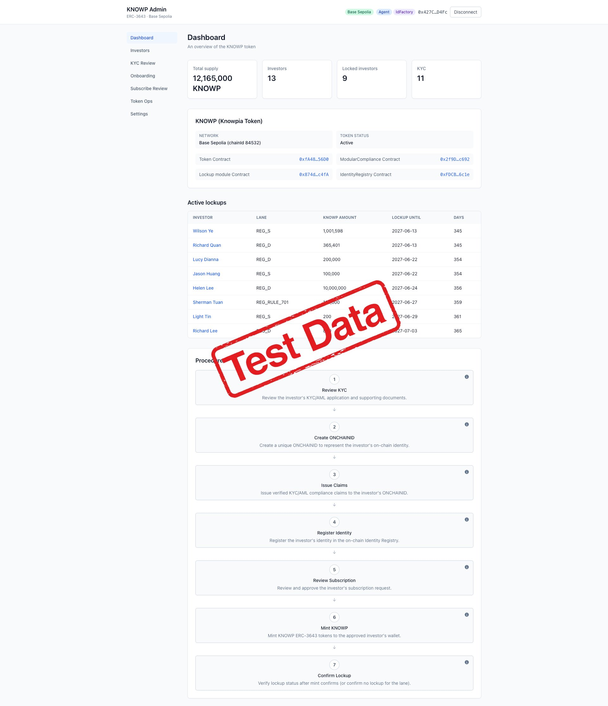
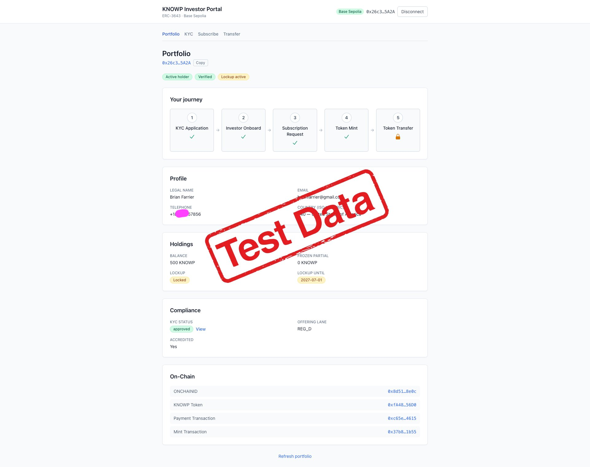
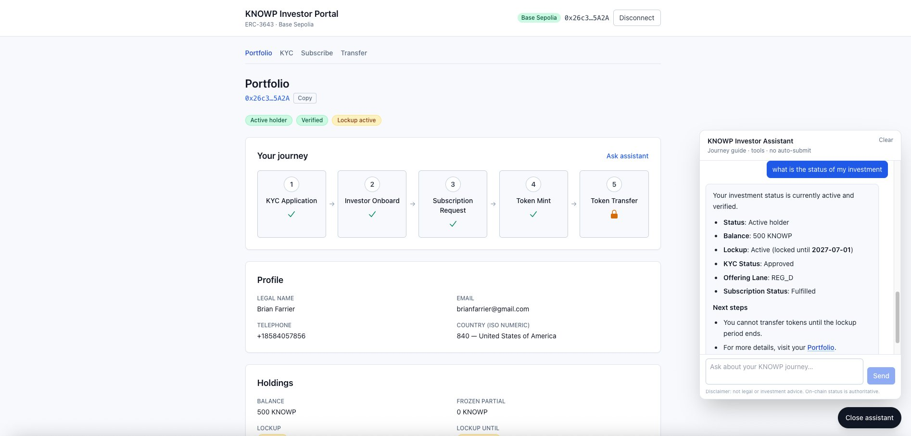
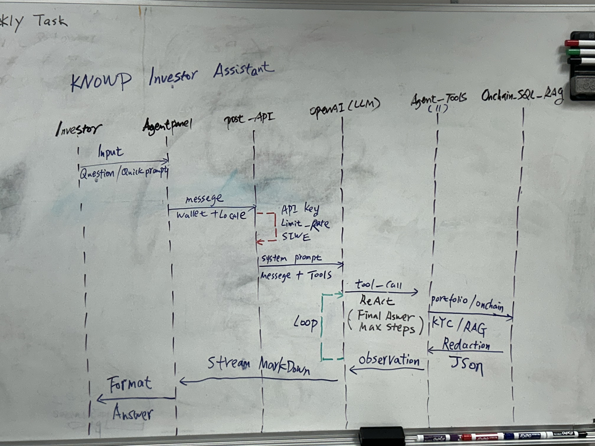

# KNOWP ERC-3643 Implementation & Investor Assistant

## Overview

This repository documents the implementation of **KNOWP** on the **ERC-3643 (T-REX)** protocol, deployed on **Base Sepolia**, along with the **KNOWP Investor Assistant (MVP)**.

The project covers the full compliance token lifecycle — identity, claims, modular compliance, offering lanes, and investor-facing tooling.

---

## 1. ERC-3643 Implementation Summary

**Date:** 2026-07-03

### On-chain Deployment (Base Sepolia)

Successfully deployed the full ERC-3643 (T-REX) stack for KNOWP, including:

- Token
- ONCHAINID
- Claim Issuer
- Identity Registry
- Modular Compliance
- **OfferingLaneLockup** module (controls transfer restrictions by offering lane)

**Defined structures:**
- 5 Offering Lanes
- 2 types of Subject Claims

### Off-chain Systems

In addition to CLI-based module development and end-to-end integration, two web applications were launched:

#### Admin Portal
- KYC review
- Investor onboarding (create identity → issue claims → register identity → mint → confirm lockup)
- Subscription review
- Token operations
- Settings (lane lockup adjustment, claim definitions)

**Role clarity established:**
- Issuer
- Claim Issuer
- Identity Registry Agent
- Token Agent

#### Investor Portal
- Portfolio
- KYC
- Subscribe
- Transfer

**Portfolio** presents a clear 5-step progress flow:
1. Identity verification
2. Investor onboarding
3. Subscription
4. Token receipt
5. Transfer

It also displays holdings, compliance status, and on-chain records.  
*(Claims page is currently hidden — claims are issued by the Issuer side.)*

### Current Status

**Testnet closed loop is fully operational:**

---

## 2. KNOWP Investor Assistant (MVP)

**Date:** 2026-07-20  
**Status:** Complete and passed initial testing

### Description

A **crypto compliance journey guide** designed for ERC-3643 investors. It helps users with:

- Compliance questions
- Tokenization knowledge
- Guided flow through KYC / Subscription / Transfer

Before responding, the assistant uses **Tool Calling** to query live on-chain and off-chain data, then provides actionable next steps (including portal deep links).

### Key Features

- **14 tools** currently available, covering:
  - Markdown RAG search
  - Journey / KYC / Subscription eligibility checks
  - Lockup status
  - Transfer preflight checks
- **Read-only guidance only**
  - No auto-submit
  - No signing on the user’s behalf

### Roadmap

- Expand investor FAQ corpora
- Stronger multilingual retrieval (Japanese, Korean, Malay, Thai, etc.)
- Notifications and reminders
- Multi-turn checklists (e.g. “Help me verify my pre-subscription checklist” with step-by-step check-offs)

---
